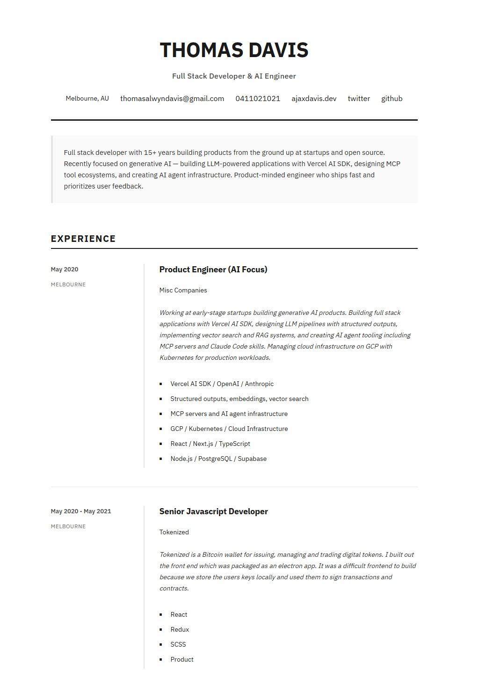

# Berlin Grid (ATS optimized)

> Based on: https://www.npmjs.com/package/jsonresume-theme-berlin-grid

Changes:
- Pure JavaScript
- No dependencies
- Safe URL removed (you can use HTML tags in texts)
- Optimized for printing (export as html, then Print to PDF)
- Optimized for ATS

## Installation

In target folder run: `npm i jsonresume-theme-berlin-grid-ats`

## Example

